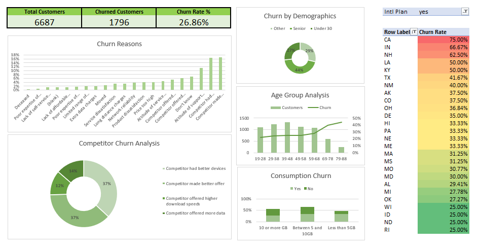
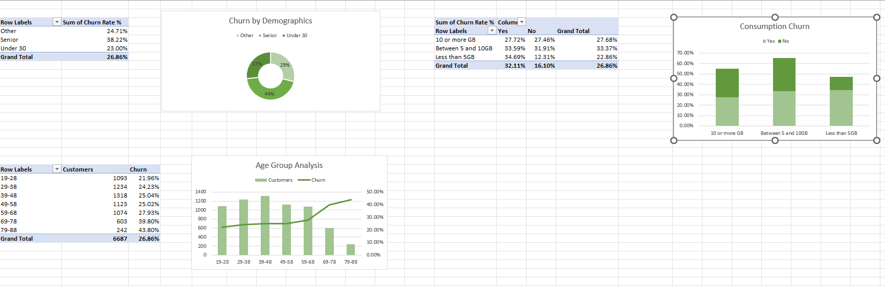
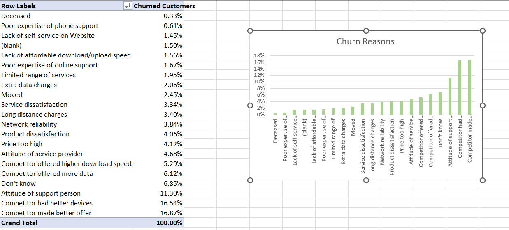
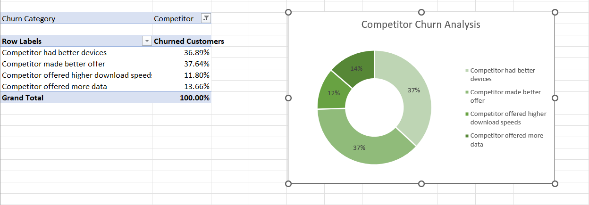

# Databel Churn Project — Insights Summary

This project analyzes customer churn for **Databel**, using data preparation and dashboards built in Excel.  
The repo contains:
- **Raw dataset:** `Databel - data.xlsx`
- **Final analysis dashboards:** `Dashboard_Insights.xlsx`

---

## 📊 Executive Summary
- **Churn rate:** 26.9% (1,796 of 6,687 customers).
- **Biggest churn drivers:**
  1. Month-to-month contracts (**46%** churn).
  2. Multiple support calls (≥3 calls → almost certain churn).
  3. Early-tenure customers (first 3–6 months).
  4. Higher monthly charges (> $40).
  5. International/data overage fees (*bill shock*).
- **At-risk groups:** seniors, paper check payers, unlimited plan users, solo customers.
- **Main churn reasons:** competitor offers, poor support experience, price/product dissatisfaction.
- **Retention levers:** push longer contracts, improve support quality, cap bill shock, bundle add-ons, expand family/group plans.

---

## 🔍 Methodology
1. **Data preparation**
   - Cleaned and structured raw customer records (6,687 rows).
   - Created tenure bands, price bands, and grouped support calls.
   - Verified churn labels and aggregated KPIs.

2. **Final dashboards (`3_5_final_solution.xlsx`)**
   - **Overview dashboard:** churn KPIs, revenue snapshot, tenure distribution.
   - **Churn analysis dashboard:** churn by contract, tenure, calls, pricing, demographics.
   - **Customer pivots:** state, payment method, plan type, add-ons, usage.

---

## 📈 Key Findings

### Contract & Tenure
- **Month-to-month:** 46.3% churn.  
- **One-year:** 11.3% churn.  
- **Two-year:** 2.8% churn.  
- Churn highest in first 3 months (**56.4%**), declines to **6.6%** after 5 years.

### Customer Support
- **0 calls:** 8.9% churn.  
- **3 calls:** 87.5% churn.  
- **4+ calls:** ~100% churn.  
➡️ Repeated support issues are the strongest churn predictor.

### Price & Plan
- ≤$20/month: **14.1%** churn.  
- $40–50/month: **38.1%** churn.  
- Unlimited plan: **32.1%** churn vs 16.1% for standard.  
- International usage active: **34.3%** churn vs 22.2%.  

### Demographics & Add-ons
- Seniors: **38.2%** churn vs under-30: **23.0%**.  
- Solo customers: **33%** churn vs group/family: **6–8%**.  
- Bundles (backup + device protection): **23%** churn vs **29%**.  

### Payment Method
- Credit card: **14.5%** churn.  
- Direct debit: **34.5%**.  
- Paper check: **38.0%**.  

### Churn Reasons
- **Competitor offers:** 805 (better devices, offers, speeds, data).  
- **Service attitude issues:** 287.  
- **Price/product dissatisfaction:** 200–286.  
➡️ Competition is the #1 stated reason; support attitude is #2.

---

## 📊 Dashboard Insights

### 📊 Churn Overview Dashboard

*➡️ Competitor offers and poor service experience drive churn, with highest risk among heavy data users and certain states.*

**Key Insights:**
- **Overall churn rate:** 26.9% (1,796 of 6,687 customers).
- **Top churn reasons:** Competitor-related (better devices 37%, better offers 37%, faster speeds 12%, more data 14%), followed by service issues and price dissatisfaction.
- **Demographics:** Seniors churn at **29%**, under-30 customers at **23%**, others at **24.7%**.
- **Age analysis:** Highest churn volume in **29–38** and **39–48** age groups.
- **Consumption churn:** Heavy users churn more than light users.
- **Geographic churn:** Highest in CA (75%), IN (66.7%), NH (62.5%).

### 👥 Demographics & Usage Dashboard

*➡️ Seniors and mid-range data users churn the most, making them prime targets for retention programs.*

**Key Insights:**
- **Churn by demographics:** Seniors churn most (**38.2%**), under 30 churn least (**23.0%**).
- **Age groups:** Older customers (69–88) have the highest churn rates (40–44%).
- **Usage patterns:** Moderate users (5–10 GB) churn most (**33.4%**), compared to light (**23.7%**) and heavy users (**27.7%**).

### ❌ Churn Reasons Breakdown

*➡️ Competitor offers and poor service attitudes explain most of the churn reasons reported.*

**Key Insights:**
- **Competitor-related reasons:** Better offers (16.9%), better devices (16.5%), more data (6.1%), higher speeds (5.3%). Together ≈ **45%** of churn.
- **Service experience:** Attitude of support person (11.3%), service provider attitude (4.7%). ≈ **16%** of churn.
- **Price & product issues:** Price too high (4.1%), product dissatisfaction (4.1%), network reliability (3.8%).
- **Other reasons:** Moving, extra charges, limited services (<3% each).

### 🏆 Competitor Churn Analysis

*➡️ Nearly three-quarters of competitive churn is due to rivals’ better offers and devices.*

**Key Insights:**
- **Better offers (37.6%)** and **better devices (36.9%)** dominate competitive churn (≈75% combined).
- **Speeds (11.8%)** and **data (13.7%)** matter, but less than pricing and device appeal.
- Confirms churn is driven by **competitive positioning** more than internal product gaps.

## ✅ Recommendations

1. **Pre-empt M2M churn**  
   - Customers on month-to-month contracts are the most churn-prone (46% churn rate).  
   - Launch targeted retention campaigns at key lifecycle points (30/60/90 days).  
   - Offer short-term discounts, bonus data, or loyalty points to build early trust and reduce “try-and-leave” behavior.  

2. **Triage high-call customers**  
   - Customers who contact support multiple times (≥3 calls) are almost guaranteed to churn.  
   - Flag these accounts in the CRM and automatically route them to a **retention specialist**.  
   - Provide save agents with **empowered offers** (bill credits, upgraded plans, or priority service) to resolve issues and restore satisfaction quickly.  

3. **Plan redesign to reduce *bill shock***  
   - Churn accelerates above $40/month and among customers hit with extra international/data charges.  
   - Smooth out price tiers so customers don’t feel penalized for moderate usage.  
   - Introduce caps or alerts on overages to prevent unexpected bills.  
   - Bundle “peace of mind” options (like unlimited international texting or capped roaming fees) to improve predictability.  

4. **Encourage contract upgrades**  
   - Two-year contracts have the lowest churn (2.8%) compared to month-to-month (46%).  
   - Incentivize customers to switch by offering:  
     - **Device credits or upgrades** on renewal.  
     - **Loyalty points** or exclusive perks (priority support, streaming add-ons).  
     - **Discounted rates** for committing to longer terms.  

5. **Promote bundles & family/group plans**  
   - Solo customers churn at ~33% vs only ~6–8% for those in group/family plans.  
   - Encourage customers to add family lines or bundle services (e.g., device protection, cloud backup).  
   - Highlight both **cost savings** and **convenience** to lock in households rather than individuals.  

6. **Train and empower support staff**  
   - Attitude of support personnel is a top-3 churn reason (over 11%).  
   - Invest in **customer empathy and resolution training** to improve first-call satisfaction.  
   - Align KPIs not only on call handling time, but also on **customer save rate**.  
   - Empower agents with tools and offers so they can resolve complaints without escalations.  

---

### 🌟 Summary
The strongest retention strategy combines **early engagement**, **proactive support**, and **contract/bundle incentives**. By tackling both the *emotional drivers* (service quality, trust) and *financial drivers* (pricing, bill shock), Databel can substantially reduce churn while building long-term customer loyalty.
 

---

## 🚀 Takeaway
Churn is driven less by *who* the customers are and more by **contract type, support experience, and bill shock**.  
By focusing on **longer contracts, proactive support, and reducing overages**, Databel can cut churn dramatically while boosting customer lifetime value.
Churn is driven less by *who* the customers are and more by **contract type, support experience, and bill shock**.  
By focusing on **longer contracts, proactive support, and reducing overages**, Databel can cut churn dramatically while boosting customer lifetime value.
